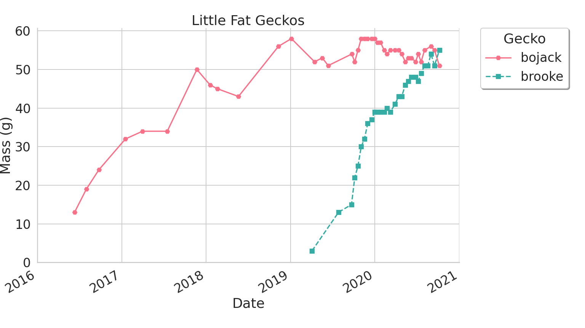

# Gecko Fatness

Repo containing data and plotting script for the fatness of my geckos.

## Data

Data is stored in CSV files in the `data` directory. One gecko per file.

## Plotting

Run the script to view the figure, selecting which file(s) to view.

``` bash
python3 plot-litte-fat-geckos.py -i data/bojack.csv data/brooke.csv
```

Use the `-h/--help` option for further usage information.


### Example

E.g. to generate a plot of Bojack and Brooke's weights:

```bash
python plot-litte-fat-geckos.py -i data/bojack.csv data/brooke.csv -o samples/bojack-and-brooke.png -f
```




## Python Environment

### Linux (venv)

@todo

### Windows (Conda)

Using conda on windows, create a new environment and activate it

```bash
conda create -n little-fat-geckos
conda activate little-fat-geckos
```

Install required pacakges

```
conda install --file requirements.txt
```

To run the script, ensure the conda environment is active.